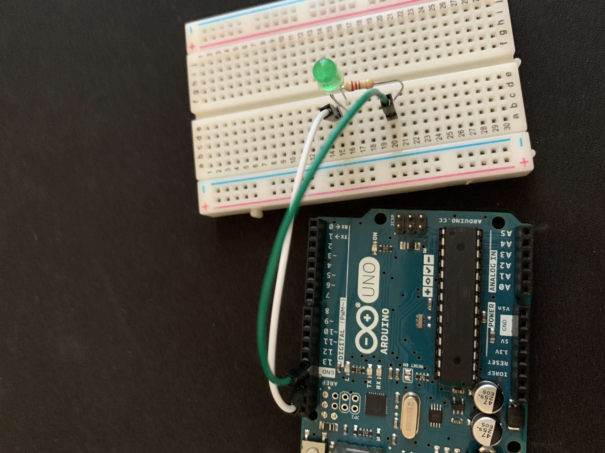

# BasicArduino
I'm going to learn how to use an Arduino, and make awesome things with it!


## TableofContents
* [TableOfContents](#TableOfContents)
* [HelloArduino](#HelloArduino)
* [FiniteLEDBlink](#FiniteLEDBlink)

## HelloArduino

### Description & Code

```C++

  /*
  Blink

  Turns an LED on for one second, then off for one second, repeatedly.

  Most Arduinos have an on-board LED you can control. On the UNO, MEGA and ZERO
  it is attached to digital pin 13, on MKR1000 on pin 6. LED_BUILTIN is set to
  the correct LED pin independent of which board is used.
  If you want to know what pin the on-board LED is connected to on your Arduino
  model, check the Technical Specs of your board at:
  https://www.arduino.cc/en/Main/Products

  modified 8 May 2014
  by Scott Fitzgerald
  modified 2 Sep 2016
  by Arturo Guadalupi
  modified 8 Sep 2016
  by Colby Newman

  This example code is in the public domain.

  http://www.arduino.cc/en/Tutorial/Blink
*/

// the setup function runs once when you press reset or power the board
void setup() {
  // initialize digital pin LED_BUILTIN as an output.
  pinMode(LED_BUILTIN, OUTPUT);
  Serial.begin(9600);
  Serial.println("Hello World");
}

// the loop function runs over and over again forever
void loop() {
  digitalWrite(LED_BUILTIN, HIGH);   // turn the LED on (HIGH is the voltage level)
  Serial.print("Blink!");
  delay(250);                       // wait for a second
  digitalWrite(LED_BUILTIN, LOW);    // turn the LED off by making the voltage LOW
  delay(250);                       // wait for a second
}
  

```

### Evidence
[Here is my code on Arduino Create](https://create.arduino.cc/editor/Klenert17/cc864f69-3c59-4761-82d2-63bb23dcf5f7)

### Image or Wiring


### Reflection

While coding this, I found it hard to know what code needs to go where. Through  looking at the code put under "Exapmles" on the Arduino Editor, I found how to make it blink. 

## FiniteLEDBlink

### Description & Code

```C++
/*
  Blink

  Turns an LED on for one second, then off for one second, repeatedly.

  Most Arduinos have an on-board LED you can control. On the UNO, MEGA and ZERO
  it is attached to digital pin 13, on MKR1000 on pin 6. LED_BUILTIN is set to
  the correct LED pin independent of which board is used.
  If you want to know what pin the on-board LED is connected to on your Arduino
  model, check the Technical Specs of your board at:
  https://www.arduino.cc/en/Main/Products

  modified 8 May 2014
  by Scott Fitzgerald
  modified 2 Sep 2016
  by Arturo Guadalupi
  modified 8 Sep 2016
  by Colby Newman

  This example code is in the public domain.

  http://www.arduino.cc/en/Tutorial/Blink
*/

// the setup function runs once when you press reset or power the board
void setup() {
  // initialize digital pin LED_BUILTIN as an output.
  pinMode(LED_BUILTIN, OUTPUT);
  Serial.begin(9600);
  Serial.println("Hello World");
}

// the loop function runs over and over again forever
void loop() {
  digitalWrite(LED_BUILTIN, HIGH);   // turn the LED on (HIGH is the voltage level)
  Serial.print("Blink!");
  delay(250);                       // wait for a second
  digitalWrite(LED_BUILTIN, LOW);    // turn the LED off by making the voltage LOW
  delay(250);                       // wait for a second
}

```

### Evidence

[Here is my code on Arduino Create](https://create.arduino.cc/editor/Klenert17/cc864f69-3c59-4761-82d2-63bb23dcf5f7)

### Image or Wiring



### Reflection

When wireing, I made my wires be in the same place as the diagram, but when I put in the code, the light didn't blink. I moved the wires to GND and 13, and that made the light blink.
